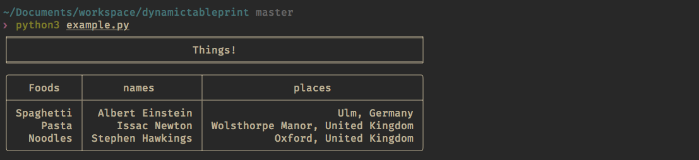
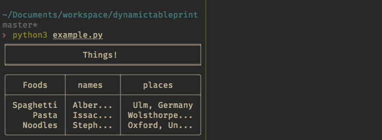

## About
This python3 module aims to add additional functionality to the already amazing
TablePrint (github.com/nirum/tableprint).

While TablePrint is functionally excellent at printing out text to
the console in a beautiful manner, I have found that it lacks some dynamicism.
When printing to a console that is constantly different sizes for example,
wrapping the text around produces basically illegible tables.

This module aims to improve the situation where the user is doing data heavy
string representation, using data processing packages such as Pandas (which,
this module only supports, and also, _thank you_ to nirum for adding in Pandas
DataFrame support). Based on the size of the console, and some priorities to
each column given by the user, we will squish columns as needed until it fits
nicely within the given constraints. When the console width changes, the
program will need to be reloaded, but will adjust to fit the new screen.

## Installation
You can install this program via pip
> pip install dynamictableprint

## Usage
```py
from dynamictableprint import DynamicTablePrint
import pandas as pd

d = {
    'names': [
        "Albert Einstein",
        "Issac Newton",
        "Stephen Hawkings"
    ],
    'places': [
        "Ulm, Germany",
        "Wolsthorpe Manor, United Kingdom",
        "Oxford, United Kingdom"
    ],
    'Foods': [
        "Spaghetti",
        "Pasta",
        "Noodles"
    ]
}
data_frame = pd.DataFrame(data=d)

dtp = DynamicTablePrint(data_frame, angel_column='Foods', squish_column='places')
dtp.banner('Things!')
dtp.write_to_screen()
```

### Without boundaries

Without boundaries to the terminal size, the data frame is displayed normally

### With boundaries

With boundaries, the squish column is the first column that is compressed, with
the other columns following suit until the final column, the `angel_column`.
In terms of priority it follows this rule.

### Priority
*****Squish Column -> Other Columns -> Angel Column**

The `squish_column` represents the column that you would like to be squished
first. Typically the 'squish factor' is 20% at most, but will dynamically vary
depending on how the other columns are. The `angel_column` is the column that
you would prefer to be modified last, that is, having the highest priority on
being the same.

## Dependencies
- `python3.6`, an possibly other versions `>3.0`
- `tableprint`
- `pandas`

## License
`MIT`
